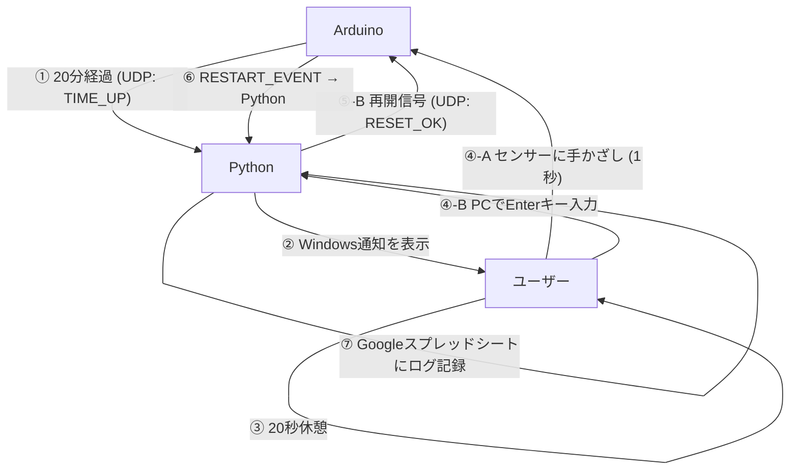

# Smart Eye-Care System

このプロジェクトは、超音波センサーでユーザーの着席を検知し、20分の作業ごとに20秒の休憩を促す「スマート眼精疲労防止ガジェット」です。Arduino (UNOR4 WiFi) と Python (Windowsゲートウェイ) が連携して動作します。

## 動作に必要なもの

| コンポーネント | 役割 | 必須度 |
|---|---|---|
| **Arduino** (`eyecare-template.ino` を書き込んだもの) | 着席検知・タイマー・休憩誘導・手かざし検知・ログ送信 | **必須** |
| **Python スクリプト** (`udp-logger.py`) | Windowsデスクトップ通知の表示 | 任意 |

> **Pythonスクリプトがなくても、Googleスプレッドシートへのログ記録は動作します。**
> Arduino が直接 Google Apps Script に HTTPS 送信するため、PC は不要です。

## システム連携図

## 各コンポーネントの役割

### 1. Arduino (`eyecare-template.ino`)
*   **着席検知**: 超音波センサーで80cm以内に人がいるか監視します。
*   **タイマー管理**: 人がいる間だけ作業時間を累積します。
*   **休憩誘導**: 休憩時間になるとOLEDに残り秒数を表示し、赤LEDとブザー（ドラクエ・ポケモン回復風メロディ）でアラートを出します。
*   **再開検知**: センサーへの手かざし（15cm以内で1秒）、またはPC側からの再開合図を受信して計測モードに復帰します。

### 2. Python Gateway (`udp-logger.py`) ※必須
*   **通知**: Arduinoからの信号を受け取り、Windowsのデスクトップ通知を表示します。
*   **休憩管理**: 20秒のカウントダウンを画面に表示します。
*   **記録**: 再開が検知されると、Googleスプレッドシートにログを送信します。
*   **制御**: ユーザーがEnterキーを押すと、Arduinoに再開の信号を返します（バックアップ操作）。

## 導入方法

### ハードウェア構成
*   Arduino UNO R4 WiFi
*   超音波センサー (HC-SR04)
*   OLEDディスプレイ (SSD1306, 128x64)
*   LED（赤・緑）
*   パッシブブザー

### セットアップ
1.  **Arduino**:
    *   `ssid` と `password` を自分のWi-Fi環境に合わせて書き換えます。
    *   `pc_ip` をPCのIPアドレスに書き換えます。
    *   Arduino IDEでスケッチを書き込みます。
2.  **Python（任意・Windows通知が必要な場合のみ）**:
    *   Pythonをインストール済みであることを確認します。
    *   `python udp-logger.py` を実行します。
    *   ファイアウォールの警告が出た場合は、UDP 5005ポートの通信を許可してください。

## 使い方
1.  Arduinoデバイスを起動します。緑LEDが点灯しカウントダウンが始まります。（離席すると中断）
2.  20分経過するとArduinoが休憩モード（20秒）に入ります。（PCでPythonを起動している場合はWindows通知も届きます）
3.  20秒経過後、超音波センサーに手をかざす（15cm以内で1秒間）と、次のサイクルが始まりGoogleスプレッドシートに自動でログが記録されます。PCでEnterキーを押すことでも再開できます。

[アイケアスプレッドシート　ログ](https://docs.google.com/spreadsheets/d/1GVeTNaiIqg9THnKGMKAm8ZsvyVecBAWqQ8LLO331-pg/edit?usp=sharing)

