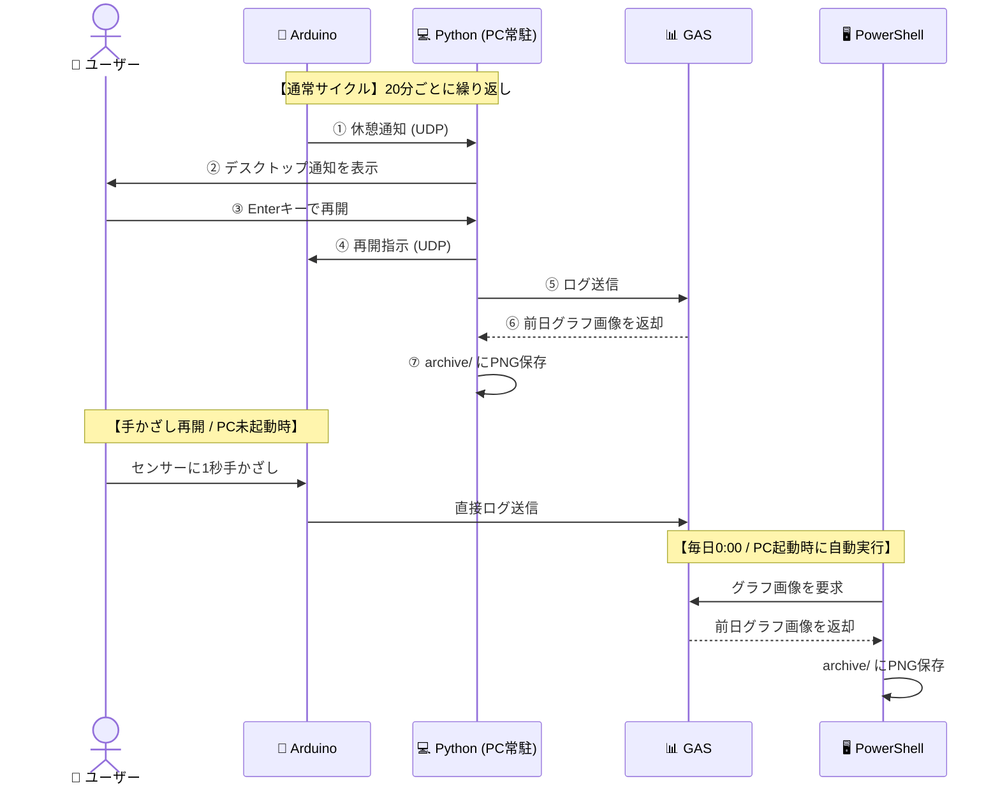

# Smart Eye-Care System

超音波センサーでユーザーの着席を検知し、**20分の作業ごとに20秒の目の休憩を促す**ガジェットです。  
Arduino (UNO R4 WiFi) と Python (PC常駐アプリ)、Google Apps Script (GAS) が連携して動作します。

---

## 主な機能

| # | 機能 | 概要 |
|---|------|------|
| 1 | **着席検知＆タイマー** | 超音波センサーで着席を判定し、在席中のみ作業時間を累積 |
| 2 | **休憩アラート** | 20分経過でLED・OLEDカウントダウン・ブザー・PC通知を同時に発報 |
| 3 | **ジェスチャー操作** | センサーに1秒手かざしで一時停止・再開。PCのEnterキーでも再開可能 |
| 4 | **OLEDスリープ** | 離席10秒後に画面を自動消灯（焼き付き・省電力対策） |
| 5 | **前日グラフ自動保存** | 毎日0:00にタスクスケジューラ＋PowerShellが前日分グラフ画像をローカル保存 |

---

## 必要なもの

**ハードウェア**
- Arduino UNO R4 WiFi
- 超音波センサー (HC-SR04)
- LED × 2（赤・緑）
- ブザー（圧電スピーカー）
- OLED ディスプレイ（SSD1306、128×64、I2C接続）

**ソフトウェア・アカウント**
- Arduino IDE
- Python 3.x（Windows）
- Google アカウント（スプレッドシート用）

---

## システム連携図



---

## セットアップ手順

### Step 1. GAS（Googleスプレッドシート）

1. 新しい Google スプレッドシートを作成します。
2. 「拡張機能」→「Apps Script」を開きます。
3. エディタのコードを `gas/gas-code.js` の内容で**すべて上書き**して保存します。
4. 「デプロイ」→「新しいデプロイ」→種類「ウェブアプリ」で公開します。
   - アクセスできるユーザー：**全員**
5. 発行された **デプロイURL** をコピーしておきます（以降の手順で使います）。

---

### Step 2. Arduino

1. `eyecare-template/eyecare-template.ino` を Arduino IDE で開きます。
2. ファイル冒頭の以下の項目を書き換えます。

   ```cpp
   const char* ssid     = "YOUR_WIFI_SSID";
   const char* password = "YOUR_WIFI_PASSWORD";
   const char* pc_ip    = "192.168.x.x";        // PCのローカルIPアドレス
   const char* GAS_PATH = "/macros/s/YOUR_GAS_SCRIPT_ID/exec"; // GAS URLのID部分のみ
   ```

3. Arduino IDE のライブラリマネージャーから以下をインストールします。
   - `Adafruit SSD1306`
   - `Adafruit GFX Library`
4. Arduino 本体に書き込みます。

---

### Step 3. Python（PC常駐アプリ）

1. `udp-logger-template.py` をコピーし、任意の場所に配置・リネームします。
2. ファイル冒頭の以下の項目を書き換えます。

   ```python
   GAS_URL     = "YOUR_GAS_SCRIPT_URL"   # Step 1 でコピーしたURL
   ARCHIVE_DIR = r"C:\your\archive\path" # グラフ画像の保存先フォルダ（任意）
   ```

3. 実行します。

   ```powershell
   python udp-logger.py
   ```

---

### Step 4. PowerShell 自動保存（PCが起動していない時間帯の補完）

1. `eyecare-template/get_archive-template.ps1` をコピーし、任意の場所に配置・リネームします。
2. ファイル冒頭の以下の項目を書き換えます。

   ```powershell
   $GAS_URL = "YOUR_GAS_SCRIPT_URL"  # Step 1 でコピーしたURL
   ```

   > `ARCHIVE_DIR` はスクリプト内でマイドキュメント配下に自動生成されます。  
   > 保存先を変更したい場合はスクリプト内の `$ARCHIVE_DIR` の行を編集してください。

3. 管理者権限の PowerShell で以下を実行し、タスクスケジューラに登録します。  
   （`$psPath` は実際に配置した `get_archive.ps1` のフルパスに変更してください）

   ```powershell
   $psPath = "C:\path\to\get_archive.ps1"
   $action = New-ScheduledTaskAction -Execute "powershell.exe" `
       -Argument "-WindowStyle Hidden -ExecutionPolicy Bypass -File `"$psPath`""
   $trigger = New-ScheduledTaskTrigger -Daily -At 00:00
   $settings = New-ScheduledTaskSettingsSet -AllowStartIfOnBatteries `
       -DontStopIfGoingOnBatteries -StartWhenAvailable
   Register-ScheduledTask -TaskName "SmartEyeCare_ArchiveDownloader" `
       -Action $action -Trigger $trigger -Settings $settings -Force
   ```

> [!TIP]
> **過去の画像を後から取り直す方法**
>
> 特定の日の画像が欠落している場合、日付を指定して実行すると取得できます。
>
> ```powershell
> powershell -ExecutionPolicy Bypass -File "C:\path\to\get_archive.ps1" -TargetDate "YYYY-MM-DD"
> ```

---

> [!NOTE]
> **デモ動画についての注意点**
>
> 動作デモ動画は **2026/06/22 時点**の映像です。それ以降に実装された機能（一時停止時のポーズ音・OLED自動スリープ・PowerShell自動保存）は動画内に反映されていません。

[📊 スプレッドシート ログ](https://docs.google.com/spreadsheets/d/1GVeTNaiIqg9THnKGMKAm8ZsvyVecBAWqQ8LLO331-pg/edit?usp=sharing)　　[🎬 テスト動画](https://youtube.com/shorts/iXKd-fRjQpk?feature=share)


