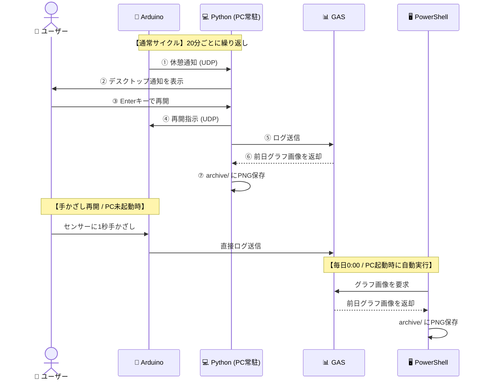

# Smart Eye-Care System

超音波センサーでユーザーの着席を検知し、**20分の作業ごとに20秒の目の休憩を促す**ガジェットです。  
Arduino (UNO R4 WiFi) と Python (PC常駐アプリ)、Google Apps Script (GAS) が連携して動作します。

---

## 主な機能

| # | 機能 | 概要 |
|---|------|------|
| 1 | **着席検知＆タイマー** | 超音波センサーで着席を判定し、在席中のみ作業時間を累積 |
| 2 | **休憩アラート** | 20分経過でLED・OLEDカウントダウン・ブザー・PC通知を同時に発報 |
| 3 | **ジェスチャー操作** | センサーに1秒手かざしで一時停止・再開。PCのEnterキーでも再開可能 |
| 4 | **OLEDスリープ** | 離席10秒後に画面を自動消灯（焼き付き・省電力対策） |
| 5 | **前日グラフ自動保存** | 毎日0:00にタスクスケジューラ＋PowerShellが前日分グラフ画像をローカル保存 |

---

## システム連携図



---

## リポジトリ構成

```
work2/
├── eyecare/
│   └── eyecare-template/
│       ├── eyecare-template.ino      # Arduinoスケッチ（要書き換え箇所あり）
│       └── get_archive-template.ps1  # PowerShellスクリプト（要書き換え箇所あり）
├── gas/
│   └── gas-code.js                   # GAS（スプレッドシート）コード
├── udp-logger-template.py            # Python常駐アプリ（要書き換え箇所あり）
├── image.png                         # 回路図
└── readme.md
```

---

## セットアップ手順

### 前提：必要なもの

- Arduino UNO R4 WiFi
- 超音波センサー (HC-SR04)、LED×2 (赤・緑)、ブザー、OLED (SSD1306 128×64)
- Windows PC（Python 3.x 導入済み）
- Google アカウント（スプレッドシート用）

---

### 1. GAS（Googleスプレッドシート）のセットアップ

1. 新しい Google スプレッドシートを作成します。
2. 「拡張機能」→「Apps Script」を開きます。
3. エディタ内のコードを `gas/gas-code.js` の内容で**すべて上書き**して保存します。
4. 「デプロイ」→「新しいデプロイ」→「ウェブアプリ」として公開します。
   - アクセスできるユーザー：**全員**
5. 発行された **デプロイURL** をコピーしておきます（後続のステップで使います）。

---

### 2. Arduinoのセットアップ

1. `eyecare/eyecare-template/eyecare-template.ino` をArduino IDEで開きます。
2. 以下の箇所を書き換えます。

   ```cpp
   const char* ssid     = "YOUR_WIFI_SSID";      // ← 自宅WiFiのSSID
   const char* password = "YOUR_WIFI_PASSWORD";   // ← WiFiパスワード
   const char* pc_ip    = "192.168.x.x";          // ← PCのローカルIPアドレス
   const char* GAS_PATH = "/macros/s/YOUR_GAS_SCRIPT_ID/exec"; // ← GAS URLのID部分
   ```

3. 必要なライブラリをインストールします（Arduino IDEのライブラリマネージャーから）。
   - `Adafruit SSD1306`
   - `Adafruit GFX Library`

4. Arduino本体に書き込みます。

---

### 3. Python（PC常駐アプリ）のセットアップ

1. `udp-logger-template.py` をコピーし、任意の場所に配置します。
2. 以下の箇所を書き換えます。

   ```python
   GAS_URL = "YOUR_GAS_SCRIPT_URL"              # ← 手順1でコピーしたGASのデプロイURL
   ARCHIVE_DIR = r"C:\YOUR\PATH\TO\archive"     # ← グラフ画像の保存先フォルダ
   ```

3. PowerShellまたはコマンドプロンプトで実行します。

   ```powershell
   python udp-logger.py
   ```

---

### 4. PowerShell自動保存のセットアップ

PCが起動していない間も前日のグラフを自動収集するための設定です。

1. `eyecare/eyecare-template/get_archive-template.ps1` をコピーし、任意の場所に配置します。
2. 以下の箇所を書き換えます。

   ```powershell
   $GAS_URL = "YOUR_GAS_SCRIPT_URL"  # ← 手順1のGASデプロイURL
   # ARCHIVE_DIR は get_archive.ps1 内でマイドキュメント配下のパスを自動生成します
   # 必要に応じて Join-Path の引数を変更してください
   ```

3. 管理者権限でPowerShellを開き、以下を実行してタスクスケジューラに登録します。

   ```powershell
   $psPath = "C:\path\to\your\get_archive.ps1"  # ← 実際のパスに変更
   $action = New-ScheduledTaskAction -Execute "powershell.exe" `
       -Argument "-WindowStyle Hidden -ExecutionPolicy Bypass -File `"$psPath`""
   $trigger = New-ScheduledTaskTrigger -Daily -At 00:00
   $settings = New-ScheduledTaskSettingsSet -AllowStartIfOnBatteries `
       -DontStopIfGoingOnBatteries -StartWhenAvailable
   Register-ScheduledTask -TaskName "SmartEyeCare_ArchiveDownloader" `
       -Action $action -Trigger $trigger -Settings $settings -Force
   ```

> [!TIP]
> **過去の画像を後から取り直す方法（リカバリー）**
>
> 特定の日の画像が欠落している場合、以下のように日付を指定して実行すると取得できます。
>
> ```powershell
> powershell -ExecutionPolicy Bypass -File "C:\path\to\get_archive.ps1" -TargetDate "YYYY-MM-DD"
> ```
>
> 例：2026年6月27日の画像を取り直す場合
> ```powershell
> powershell -ExecutionPolicy Bypass -File "C:\path\to\get_archive.ps1" -TargetDate "2026-06-27"
> ```

---

> [!NOTE]
> **デモ動画についての注意点**
>
> 動作デモ動画は **2026/06/22 時点**の映像です。それ以降に実装された機能（一時停止時のポーズ音・OLED自動スリープ・PowerShell自動保存）は動画内に反映されていません。

[📊 アイケアスプレッドシート ログ](https://docs.google.com/spreadsheets/d/1GVeTNaiIqg9THnKGMKAm8ZsvyVecBAWqQ8LLO331-pg/edit?usp=sharing)　　[🎬 アイケアテスト動画](https://youtube.com/shorts/iXKd-fRjQpk?feature=share)


