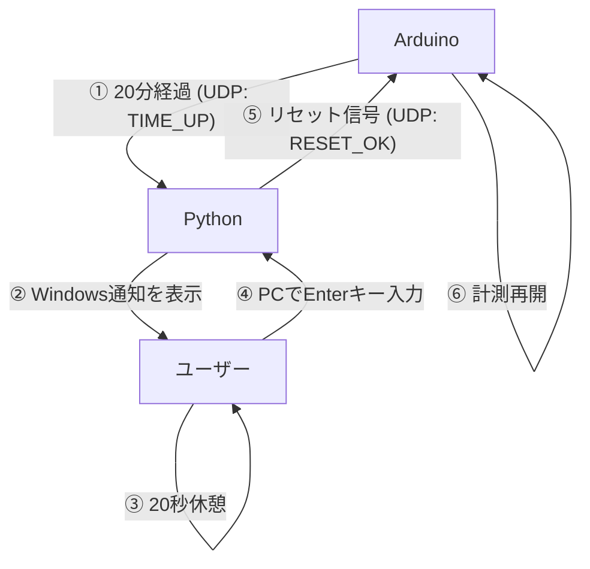

# Smart Eye-Care System

このプロジェクトは、超音波センサーでユーザーの着席を検知し、20分の作業ごとに20秒の休憩を促す「スマート眼精疲労防止ガジェット」です。Arduino (UNOR4 WiFi) と Python (Windowsゲートウェイ) が連携して動作します。

## システム連携図

## 各コンポーネントの役割

### 1. Arduino (`eyecare-0615.ino`)
*   **着席検知**: 超音波センサーで80cm以内に人がいるか監視します。
*   **タイマー管理**: 人がいる間だけ作業時間を累積します。
*   **休憩誘導**: 休憩時間になるとOLEDに残り秒数を表示し、赤LEDとブザーでアラートを出します。
*   **通信**: 休憩が必要になるとPCへ信号を送り、PCからの再開合図を待ちます。

### 2. Python Gateway (`udp-logger.py`)
*   **通知**: Arduinoからの信号を受け取り、Windowsのデスクトップ通知を表示します。
*   **休憩管理**: 20秒のカウントダウンを画面に表示します。
*   **記録**: 休憩が完了すると、Googleスプレッドシートにログを送信します。
*   **制御**: ユーザーがEnterキーを押すと、Arduinoに再開の許可（RESET_OK）を返します。

## 導入方法

### ハードウェア構成
*   Arduino UNO R4 WiFi
*   超音波センサー (HC-SR04)
*   OLEDディスプレイ (SSD1306, 128x64)
*   LED（赤・緑）
*   パッシブブザー

### セットアップ
1.  **Arduino**:
    *   `ssid` と `password` を自分のWi-Fi環境に合わせて書き換えます。
    *   `pc_ip` をPCのIPアドレスに書き換えます。
    *   Arduino IDEでスケッチを書き込みます。
2.  **Python**:
    *   Pythonをインストール済みであることを確認します。
    *   `udp-logger.py` を実行します: `python udp-logger.py`
    *   ファイアウォールの警告が出た場合は、UDP 5005ポートの通信を許可してください。

## 使い方
1.  デバイスを起動し、PCでPythonスクリプトを走らせます。
2.  作業を開始するとArduinoの緑LEDが点灯し、カウントダウンが始まります。（離席すると中断）
3.  20分経過すると、PCに通知が届き、Arduinoが休憩モード（20秒）に入ります。
4.  20秒経過後、PC側でEnterキーを押すと、再び次のサイクルが始まります。

[アイケアスプレッドシート　ログ](https://docs.google.com/spreadsheets/d/1GVeTNaiIqg9THnKGMKAm8ZsvyVecBAWqQ8LLO331-pg/edit?usp=sharing)

