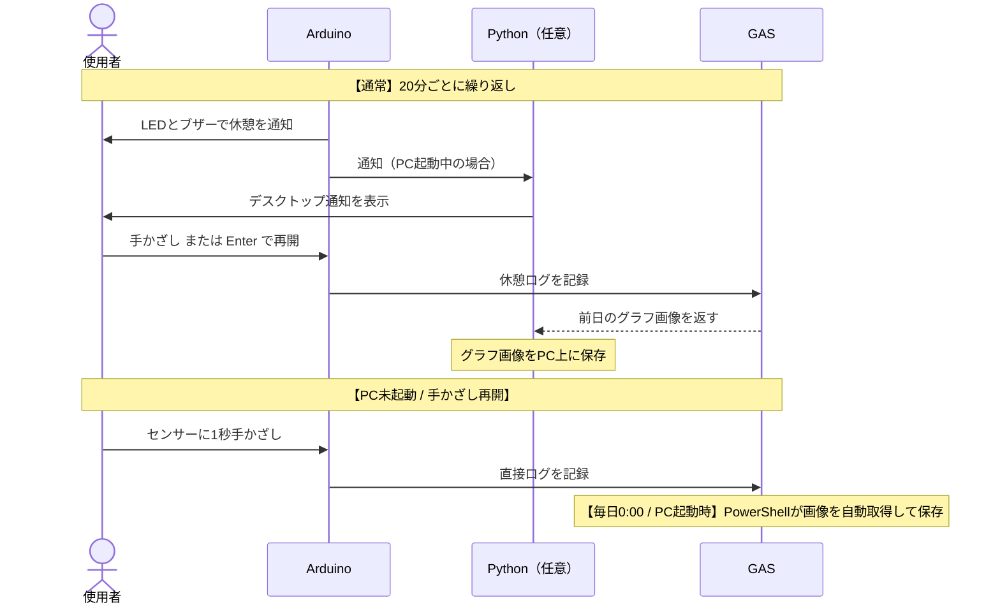

# Smart Eye-Care System

超音波センサーで着席を検知し、**20分ごとに20秒の目の休憩を促す**ガジェットです。  
Arduino (UNO R4 WiFi)・Python・Google Apps Script (GAS) を組み合わせて動作します。

---

## 機能一覧

| 機能 | 説明 |
|------|------|
| **着席検知＆タイマー** | デスクから80cm以内にいる間だけ作業時間を計測。離席で自動停止 |
| **休憩アラート** | 20分でLED点灯・OLEDカウントダウン・ブザー音が鳴り、20秒の休憩を促す |
| **ジェスチャー操作** | センサーに1秒手かざしで一時停止・再開（PCのEnterキーでも再開可） |
| **OLEDスリープ** | 離席10秒後に画面を自動消灯（焼き付き防止） |
| **グラフ記録・保存** | 休憩ログをGoogleスプレッドシートに記録し、前日分のグラフ画像をPC上に自動保存 |

---

## 必要なもの

**ハードウェア**
- Arduino UNO R4 WiFi
- 超音波センサー（HC-SR04）
- LED × 2（赤・緑）
- ブザー（任意：音を使わない場合は不要）
- OLED ディスプレイ（SSD1306、128×64、I2C接続）

**ソフトウェア・アカウント**
- Arduino IDE
- Google アカウント（スプレッドシート作成用）
- Python 3.x・Windows（任意：PC通知とグラフ自動保存を使う場合のみ）

---

## 動作の流れ



---

## セットアップ

### 1. Googleスプレッドシートの準備

1. 任意のGoogleスプレッドシートを新規作成します。
2. 「拡張機能」→「Apps Script」を開きます。
3. `gas/gas-code.js` の内容をエディタにすべて貼り付け、保存します。
4. 「デプロイ」→「新しいデプロイ」→種類「ウェブアプリ」で公開します。
   - アクセスできるアカウント：**全員**
5. 表示された**デプロイURL**をコピーします（以降のステップで使います）。

### 2. Arduinoの書き込み

1. `eyecare-template/eyecare-template.ino` をArduino IDEで開きます。
2. 以下を自分の環境に合わせて書き換えます。

   ```cpp
   const char* ssid     = "YOUR_WIFI_SSID";
   const char* password = "YOUR_WIFI_PASSWORD";
   const char* pc_ip    = "192.168.x.x";   // PCのローカルIPアドレス（Step 3を使う場合のみ）
   const char* GAS_PATH = "/macros/s/YOUR_GAS_SCRIPT_ID/exec";
   ```

3. ライブラリマネージャーから以下をインストールします。
   - `Adafruit SSD1306`
   - `Adafruit GFX Library`
4. Arduinoに書き込みます。

### 3.（任意）Pythonアプリの設定

> PCへのデスクトップ通知・グラフ画像の自動保存を使いたい場合のみ設定します。

1. `udp-logger-template.py` をコピーして任意の場所に置きます。
2. 以下を書き換えます。

   ```python
   GAS_URL     = "YOUR_GAS_SCRIPT_URL"    # Step 1のデプロイURL
   ARCHIVE_DIR = r"C:\your\archive\path"  # グラフ画像の保存先フォルダ
   ```

3. 実行します。

   ```powershell
   python udp-logger.py
   ```

### 4.（任意）PowerShellによる自動画像保存

> Pythonが起動していない時間帯（就寝中など）の画像保存漏れを補う設定です。

1. `eyecare-template/get_archive-template.ps1` をコピーして任意の場所に置きます。
2. 以下を書き換えます。

   ```powershell
   $GAS_URL = "YOUR_GAS_SCRIPT_URL"  # Step 1のデプロイURL
   ```

   > 画像の保存先はマイドキュメント配下に自動生成されます。変更する場合はスクリプト内の `$ARCHIVE_DIR` を編集してください。

3. 管理者権限のPowerShellで以下を実行してタスクスケジューラに登録します。

   ```powershell
   $psPath = "C:\path\to\get_archive.ps1"
   $action   = New-ScheduledTaskAction -Execute "powershell.exe" -Argument "-WindowStyle Hidden -ExecutionPolicy Bypass -File `"$psPath`""
   $trigger  = New-ScheduledTaskTrigger -Daily -At 00:00
   $settings = New-ScheduledTaskSettingsSet -AllowStartIfOnBatteries -DontStopIfGoingOnBatteries -StartWhenAvailable
   Register-ScheduledTask -TaskName "SmartEyeCare_ArchiveDownloader" -Action $action -Trigger $trigger -Settings $settings -Force
   ```

> [!TIP]
> **特定の日の画像が欠落している場合**、日付を指定して手動で取得できます。
>
> ```powershell
> powershell -ExecutionPolicy Bypass -File "C:\path\to\get_archive.ps1" -TargetDate "YYYY-MM-DD"
> ```

---

> [!NOTE]
> テスト動画は **2026/06/22 時点**の映像です。一時停止時のポーズ音・OLEDスリープ・PowerShell自動保存はその後に追加された機能のため、動画内には映っていません。

[🎬 テスト動画](https://youtube.com/shorts/iXKd-fRjQpk?feature=share)


