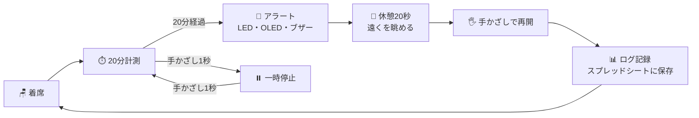
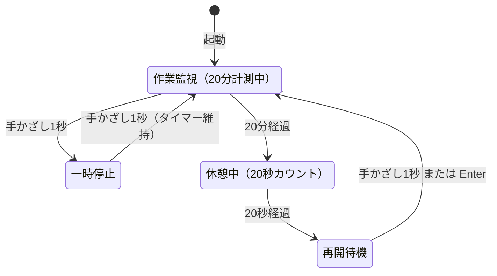
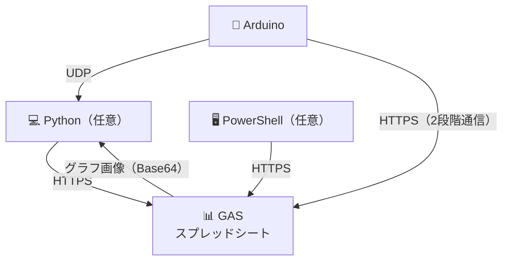

# Smart Eye-Care System

超音波センサーで着席を検知し、**20分ごとに20秒の目の休憩を促す**ガジェットです。  
Arduino (UNO R4 WiFi)・Python・Google Apps Script (GAS) を組み合わせて動作します。

---

## 機能一覧

| 機能 | 説明 |
|------|------|
| **着席検知＆タイマー** | 超音波センサーから80cm以内にいる間だけ作業時間を計測。離席で自動停止 |
| **休憩アラート** | 20分でLED点灯・OLEDカウントダウン・ブザー音が鳴り、20秒の休憩を促す |
| **ジェスチャー操作** | センサーに1秒手かざしで一時停止・再開（PCのEnterキーでも再開可） |
| **OLEDスリープ** | 離席10秒後に画面を自動消灯（焼き付き防止・節電） |
| **グラフ記録・保存** | 休憩ログをGoogleスプレッドシートに記録し、前日分のグラフ画像をPC上に自動保存 |

---

## 必要なもの

**ハードウェア**
- Arduino UNO R4 WiFi
- 超音波センサー（HC-SR04）
- LED × 2（赤・緑）
- ブザー（任意：音を使わない場合は不要）
- OLED ディスプレイ（SSD1306、128×64、I2C接続）

**ピン配線**

| 部品 | 部品側ピン | Arduino ピン |
|------|-----------|-------------|
| 超音波センサー | Trig | D2 |
| 超音波センサー | Echo | D3 |
| 超音波センサー | VCC | 5V |
| 超音波センサー | GND | GND |
| LED（緑） | ＋（※抵抗を挟む） | D5 |
| LED（緑） | − | GND |
| LED（赤） | ＋（※抵抗を挟む） | D6 |
| LED（赤） | − | GND |
| ブザー | ＋ | D7 |
| ブザー | − | GND |
| OLED | SDA | SDA（A4） |
| OLED | SCL | SCL（A5） |
| OLED | VCC | 5V |
| OLED | GND | GND |

**ソフトウェア・アカウント**
- Arduino IDE
- Google アカウント（スプレッドシート作成用）
- Python 3.x・Windows（任意：PC通知とグラフ自動保存を使う場合のみ）

---

## 動作の流れ



- PCが起動中なら、アラートと同時にデスクトップ通知も届きます（Python・任意）
- 手かざしの代わりにPCのEnterキーでも再開できます
- 前日分のグラフ画像はログ記録時にPC上に自動保存されます

---

## 仕組み

### 距離による3段階の判定

超音波センサーが常に距離を測定し、距離に応じて動作を切り替えます。

| 距離 | 判定 | 動作 |
|------|------|------|
| 0〜15cm | 手かざし | 1秒間維持で一時停止・再開のトグル |
| 15〜80cm | 着席 | 作業時間を累積（3回連続検知で確定） |
| 80cm〜 | 離席 | タイマー停止。10秒後にOLEDも消灯 |

> 「3回連続検知」の条件により、センサーの瞬間的なノイズを無視して誤カウントを防いでいます。

### Arduinoの状態遷移

プログラムは4つの状態を持ち、条件に応じて遷移します。



### システム連携



| 通信 | 説明 |
|------|------|
| **Arduino → GAS** | GASのWebアプリは302リダイレクトを返すため、①POSTでLocationヘッダを取得 → ②リダイレクト先にGETという2段階の通信を行う |
| **GAS → Python** | ログ送信のレスポンスに前日分のグラフ画像をBase64で含めて返す。Pythonがデコードしてローカルに保存する |
| **Arduino vs Python** | GASへの送信時、`client: "arduino"` か `"pc"` かで送信元を識別する。Arduinoはメモリが少ないため画像データを返さない |
| **PowerShell → GAS** | 毎日0:00にGETリクエストで前日のグラフ画像を取得。PCが0:00に起動していなくても次回起動時に自動で実行される |

---

## セットアップ

### 1. Googleスプレッドシートの準備

1. 任意のGoogleスプレッドシートを新規作成します。
2. 「拡張機能」→「Apps Script」を開きます。
3. `gas/gas-code.js` の内容をエディタにすべて貼り付け、保存します。
4. 「デプロイ」→「新しいデプロイ」→種類「ウェブアプリ」で公開します。
   - アクセスできるアカウント：**全員**
5. 表示された**デプロイURL**をコピーします（以降のステップで使います）。

   > [!TIP]
   > **GAS_PATH に入れる Script ID の取り出し方**
   >
   > デプロイURLの形式は以下の通りです。
   > ```
   > https://script.google.com/macros/s/【ここがScript ID】/exec
   > ```
   > `GAS_PATH` には `/macros/s/【Script ID】/exec` の部分（`https://script.google.com` より後ろ）を入力します。

### 2. Arduinoの書き込み

1. `eyecare-template/eyecare-template.ino` をArduino IDEで開きます。
2. 以下を自分の環境に合わせて書き換えます。

   ```cpp
   const char* ssid     = "YOUR_WIFI_SSID";
   const char* password = "YOUR_WIFI_PASSWORD";
   const char* pc_ip    = "192.168.x.x";   // PCのローカルIPアドレス（Step 3を使う場合のみ）
   const char* GAS_PATH = "/macros/s/YOUR_GAS_SCRIPT_ID/exec";
   ```

   > [!TIP]
   > **PCのローカルIPアドレスの調べ方**
   >
   > PowerShellまたはコマンドプロンプトで以下を実行し、`192.168.x.x` 形式のアドレスを `pc_ip` に入力します。
   > ```powershell
   > ipconfig
   > # → 「IPv4 アドレス」の行を確認
   > ```

3. ライブラリマネージャーから以下をインストールします。
   - `Adafruit SSD1306`
   - `Adafruit GFX Library`
4. Arduinoに書き込みます。

### 3.（任意）Pythonアプリの設定

> PCへのデスクトップ通知・グラフ画像の自動保存を使いたい場合のみ設定します。

1. `udp-logger-template.py` をコピーして任意の場所に置きます。
2. 以下を書き換えます。

   ```python
   GAS_URL     = "YOUR_GAS_SCRIPT_URL"    # Step 1のデプロイURL全体（https://から始まるもの）
   ARCHIVE_DIR = r"C:\your\archive\path"  # グラフ画像の保存先フォルダ
   ```

3. 実行します。

   ```powershell
   python udp-logger.py
   ```

### 4.（任意）PowerShellによる自動画像保存

> Pythonが起動していない時間帯（就寝中など）の画像保存漏れを補う設定です。

1. `eyecare-template/get_archive-template.ps1` をコピーして任意の場所に置きます。
2. 以下を書き換えます。

   ```powershell
   $GAS_URL = "YOUR_GAS_SCRIPT_URL"  # Step 1のデプロイURL
   ```

   > 画像の保存先はマイドキュメント配下に自動生成されます。変更する場合はスクリプト内の `$ARCHIVE_DIR` を編集してください。

3. 管理者権限のPowerShellで以下を実行してタスクスケジューラに登録します。

   ```powershell
   $psPath = "C:\path\to\get_archive.ps1"
   $action   = New-ScheduledTaskAction -Execute "powershell.exe" -Argument "-WindowStyle Hidden -ExecutionPolicy Bypass -File `"$psPath`""
   $trigger  = New-ScheduledTaskTrigger -Daily -At 00:00
   $settings = New-ScheduledTaskSettingsSet -AllowStartIfOnBatteries -DontStopIfGoingOnBatteries -StartWhenAvailable
   Register-ScheduledTask -TaskName "SmartEyeCare_ArchiveDownloader" -Action $action -Trigger $trigger -Settings $settings -Force
   ```

> [!TIP]
> **特定の日の画像が欠落している場合**、日付を指定して手動で取得できます。
>
> ```powershell
> powershell -ExecutionPolicy Bypass -File "C:\path\to\get_archive.ps1" -TargetDate "YYYY-MM-DD"
> ```

---

[🎬 テスト動画](https://youtube.com/shorts/bqjlP3qEHqo?feature=share)

## 回路図


